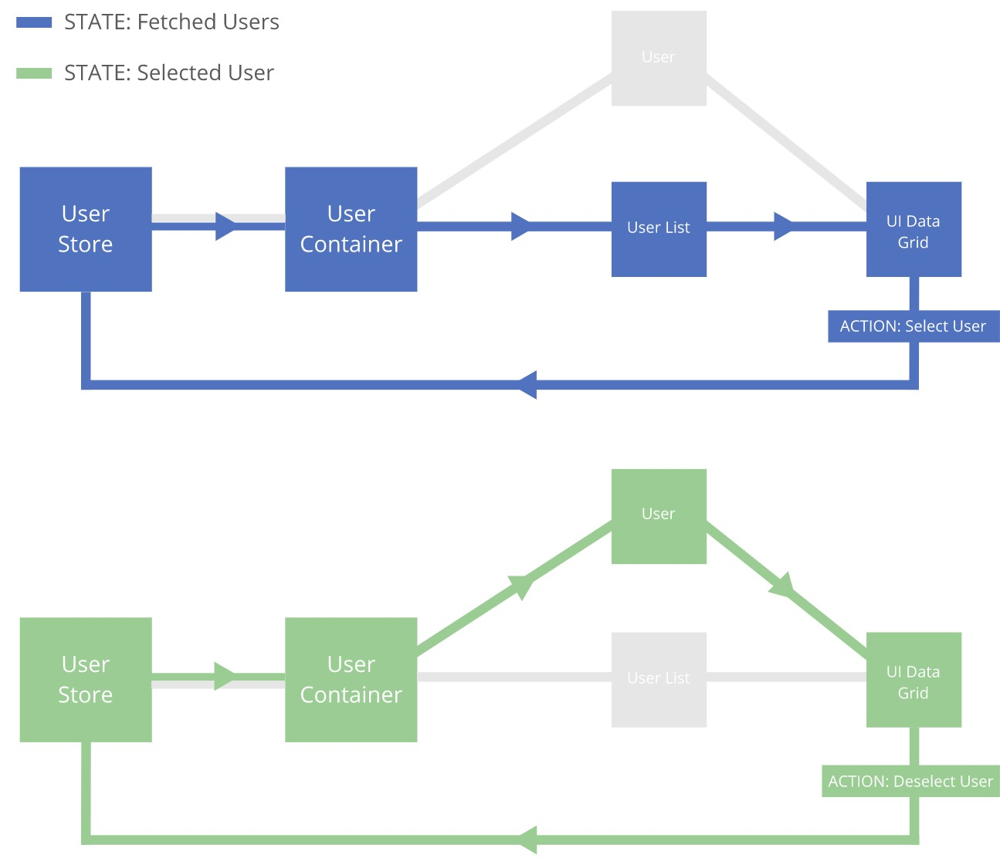

## State Driven Development (SDD)

#### Introduction

SDD is a development process where the application is designed and built
from the state down, with each domain (I.E Users, Blog Posts) being given a list of action and state types
that can be applied to it. These types are defined as a first step in the development process,
hence 'State Driven Development'. By doing this you clearly document how your application works and also gives each
state type a clear path through the application tree.

#### Application tree

The application tree contains all of the components that make up an application,
with the state types creating a path through the tree to render the correct UI.
Because the path is now so well defined and contained by the state type,
it can be easily tested using snapshots.

#### Ties with BDD

When you start building your application using SDD, you start to realise that action
and state types are basically behaviours, and because of this tying in BDD techniques
is rudimental.